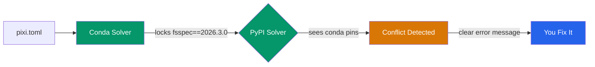

If you work on ML/AI projects with Python, you've felt the pain: conda takes forever to solve, pip can't install CUDA-linked packages from conda-forge, and poetry doesn't know what a conda channel is. You end up with a `Makefile` full of workarounds and a `README` that starts with "first, install miniconda, then..."

We wanted to know: **how much faster could this be?** So we built a real ML project with 25+ dependencies split across conda-forge and PyPI, then benchmarked six package managers head-to-head.

## The Setup

We created [a toy-but-functional ML pipeline](https://github.com/brandonrc/python-package-manager-benchmark) that mirrors what real ML teams deal with:

- **PyTorch + Lightning** for training (from conda-forge)
- **timm + transformers** for models (from PyPI)
- **albumentations + OpenCV** for data augmentation (mixed)
- **ONNX export, Gradio serving, wandb tracking**
- **~25 direct dependencies** that expand to 200+ transitive packages

The dependency list deliberately mixes conda-forge and PyPI packages. This is the scenario that breaks most tools: your team needs MKL-optimized numpy from conda-forge alongside the latest HuggingFace transformers from PyPI.

### Tools Tested

| Tool | Version | Can use conda-forge? |
|------|---------|---------------------|
| [pixi](https://pixi.sh) | 0.67.0 | Yes (native) |
| [uv](https://docs.astral.sh/uv/) | 0.11.7 | No (PyPI only) |
| [conda](https://docs.conda.io) | 26.1.1 | Yes |
| [mamba](https://mamba.readthedocs.io) | 2.5.0 | Yes |
| [pip](https://pip.pypa.io) | 25.3 | No (PyPI only) |
| [poetry](https://python-poetry.org) | 2.3.4 | No (PyPI only) |

For tools that can't use conda-forge (uv, pip, poetry), we used PyPI equivalents for every package (e.g., `opencv-python-headless` instead of conda-forge `opencv`). This is a fair comparison because it reflects what those tools can actually do.

All benchmarks ran on **Rocky Linux 8.10, x86_64** with cached packages (warm install). Each measurement is the median of 2 runs.

## Results

### Install Time

The difference is dramatic. **uv recreates the environment in 2.1 seconds.** Pixi takes 21.8 seconds. Meanwhile, conda and pip are both north of 2.5 minutes.

| Tool | Warm Install | Speedup vs conda |
|------|-------------|-----------------|
| uv | 2.1s | **78x faster** |
| pixi | 21.8s | **7.5x faster** |
| poetry | 86.6s | 1.9x faster |
| mamba | 104.8s | 1.6x faster |
| pip | 163.5s | ~same |
| conda | 163.6s | baseline |

uv's speed comes from its Rust-based resolver and aggressive caching. But uv can only install from PyPI. If your project needs conda-forge packages (CUDA toolkits, MKL-optimized libraries, compiled C extensions), uv isn't an option.

**Pixi is the interesting one.** It's 7.5x faster than conda while supporting both conda-forge and PyPI in a single config file. No `pip:` subsection in `environment.yml`. No post-install scripts. One `pixi.toml`, one command.

### Lockfile Generation

Only three tools generate lockfiles: uv, pixi, and poetry. (conda and mamba rely on the third-party `conda-lock` tool, which we didn't include.)

| Tool | Lockfile Gen |
|------|-------------|
| uv | 0.5s |
| pixi | 19.5s |
| poetry | 30.5s |

uv's resolver is absurdly fast. It generates a complete lockfile for 200+ packages in half a second. Pixi takes 19.5s, which is still reasonable. Poetry is the slowest at 30.5s, but it also does the most work (it resolves cross-platform compatibility).

### Conda-Forge Head to Head

If your team is currently using conda or mamba and needs conda-forge, this is the comparison that matters:

| Tool | Warm Install | Speedup |
|------|-------------|---------|
| pixi | 21.8s | baseline |
| mamba | 104.8s | **4.8x slower** |
| conda | 163.6s | **7.5x slower** |

Pixi uses the same conda-forge packages as conda/mamba but with a faster solver (based on the `rattler` library, written in Rust). The environments are functionally equivalent, just faster to create.

### Disk Footprint

| Tool | Disk Usage |
|------|-----------|
| uv | 5.7 GB |
| poetry | 5.7 GB |
| pip | 6.0 GB |
| mamba | 6.1 GB |
| conda | 6.1 GB |
| pixi | 6.3 GB |

Disk usage is roughly similar across tools (5.7--6.3 GB). The conda-forge tools (pixi, conda, mamba) are slightly larger because conda packages include additional metadata and sometimes platform-specific binaries.

## The Mixed-Distribution Problem

The most interesting finding wasn't a number. It was the debugging we had to do to get all six tools working.

When you pull packages from two different distribution systems — conda packages and PyPI wheels — you're dealing with independent version graphs that nobody fully reconciles. (Note: this is different from conda's own mixed-*channel* issues, like combining conda-forge with defaults or bioconda. This is about mixing conda and PyPI as distribution systems entirely.)

- **fsspec**: conda-forge ships v2026.3.0, but PyPI's `datasets` library caps it at v2024.6.1
- **pyarrow**: conda-forge ships v23.0, but older `datasets` versions use APIs removed in pyarrow 23
- **torchvision**: conda-forge pins it to match their PyTorch build, but PyPI's `timm` pulls a different version

These aren't edge cases. This is what happens on basically every ML project that mixes distributions. And the reason it keeps happening comes down to how these tools solve dependencies.

### How Conda Handles It (Spoiler: It Doesn't)

Conda solves dependencies in one world only — conda packages. When your `environment.yml` has a `pip:` subsection, conda solves and installs its own packages first, then hands off to pip as a subprocess. The two solvers never talk to each other. Conda has no idea what pip needs, and pip has no idea what conda already installed.

So when conda locks `fsspec==2026.3.0` and then pip tries to install `datasets` which requires `fsspec<=2024.6.1`, nobody catches the conflict until pip either overwrites conda's version (breaking other packages) or just fails.

Conda 4.6+ added a `pip_interop_enabled` flag to improve awareness, but it's off by default because of the performance hit. The [official Anaconda guidance](https://www.anaconda.com/blog/using-pip-in-a-conda-environment) is basically: install conda packages first, pip packages last, and don't mix more than you have to. For more details, see the [conda source](https://github.com/conda/conda) and their [pip interoperability docs](https://docs.conda.io/projects/conda/en/stable/user-guide/configuration/pip-interoperability.html).

### How Pixi Handles It (Better, But Not Magic)

Pixi also solves in two phases, but with an important difference: phase two knows about phase one.

First, pixi's Rust-based SAT solver ([resolvo](https://github.com/prefix-dev/resolvo), part of the [rattler](https://github.com/prefix-dev/rattler) library) resolves all conda-forge dependencies. Then a second solver ([PubGrub](https://github.com/pubgrub-rs/pubgrub), the same one used by uv) resolves PyPI dependencies — but with every conda package locked as a hard constraint. Pixi even maps conda package names to their PyPI equivalents using [parselmouth](https://github.com/prefix-dev/parselmouth) so the PyPI solver understands what's already installed.

The result: when conda pins `fsspec==2026.3.0` and a PyPI package can't work with that version, pixi fails with an explicit error telling you exactly which conda pin caused the problem. Conda would just silently install both and let you discover the breakage at runtime.

The tradeoff is that pixi can't backtrack across phases. If conda pins a version too high, the PyPI solver can't ask conda to reconsider — it just fails. You fix it by moving the conflicting package to conda-forge (where the solver can reason about it) or by adding version constraints. That's what we had to do with `datasets`: move it from `[pypi-dependencies]` to `[dependencies]` so both fsspec and datasets lived in the same solver phase.

There's an important nuance here: `pixi add numpy` (no flags) will default to conda-forge, which is the right call. But if someone hand-writes a `pixi.toml` — or migrates from a `requirements.txt` — and puts a package in `[pypi-dependencies]` that's actually available on conda-forge, pixi won't catch that. It respects what you wrote and installs from PyPI, mixed-distribution conflicts and all.

Pixi uses [parselmouth](https://github.com/prefix-dev/parselmouth) to map conda packages *down* to their PyPI equivalents so the PyPI solver knows what's already covered. But it doesn't go the other direction — there's no warning that says "hey, `datasets` is in your PyPI deps but conda-forge has it, consider moving it." That's the gap we hit. The fix was manual: move `datasets` from `[pypi-dependencies]` to `[dependencies]` so it lived in the same solver phase as `fsspec`.

The practical takeaway: use `pixi add` instead of hand-editing `pixi.toml` when you can, and when you do hand-edit, check if your PyPI dependencies are available on conda-forge first. The fewer packages that cross the distribution boundary, the fewer conflicts you hit.

For a deeper look at the architecture, check out the [pixi conda-pypi docs](https://pixi.sh/latest/concepts/conda_pypi/) and prefix-dev's blog post on [PyPI support in pixi](https://prefix.dev/blog/pypi_support_in_pixi).

## Recommendations

**If your project is pure PyPI:** use uv. It's not close. 2-second installs, sub-second lockfiles, and it handles Python version management too.

**If your project needs conda-forge:** use pixi. It's 5-8x faster than conda/mamba, generates lockfiles natively, and handles mixed conda-forge + PyPI dependencies in one config. The migration from `environment.yml` to `pixi.toml` is straightforward.

**If you're stuck on conda/mamba:** at minimum, switch from conda to mamba. It uses the same package format but solves 1.6x faster.

**poetry and pip:** still work fine for pure-Python projects, but there's no performance reason to choose them over uv in 2026.

## Methodology

- **System**: Rocky Linux 8.10, x86_64, 56 cores
- **Benchmark type**: Warm install (packages cached, environment deleted between runs)
- **Runs**: Median of 2 runs per tool
- **Project**: 25 direct dependencies (PyTorch, Lightning, timm, transformers, albumentations, OpenCV, etc.) expanding to ~200 transitive packages
- **Source code**: [brandonrc/python-package-manager-benchmark](https://github.com/brandonrc/python-package-manager-benchmark)

All benchmark code is open source. Clone the repo, install the tools you want to test, and run `python benchmark/runner.py`.
