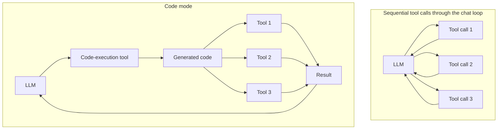

While exploring designs for running an LLM inside a desktop application, I ended up digging into where sandboxing matters in agent systems.

A useful definition of an agent is Simon Willison's ["an LLM in a loop with access to tools"](https://simonwillison.net/2025/Sep/18/agents/). There are many ways to expose those tools: MCP servers, framework-native tools in Pydantic AI, custom API wrappers, or even shell commands.

A sandbox is an isolated execution environment that limits what a program can read, write, execute, or reach over the network. In agent systems, sandboxes limit the damage a model can do if it misunderstands an instruction, follows a prompt injection, or uses a powerful tool too aggressively.

The key point is that not every agent needs a sandbox. If a model can only read a calendar through a narrowly scoped API, sandboxing may not be the first problem to solve. Sandboxing becomes urgent when the tool you give the model can execute code.

## Why Coding Agents Make This Obvious

The most visible example is the modern coding agent: Claude Code, Codex, Pi connected to a frontier model, and similar tools. In many cases, these systems are an LLM with shell access: the model reasons about the task, writes code or commands, runs them, inspects output, and repeats until the job is done.

With state-of-the-art hosted models, this is increasingly powerful. Users can ask for arbitrary tasks without wiring up a custom MCP server first. The model can often create the helper script or one-off tool it needs on the fly. It feels magical because the model's reasoning, code writing, and background knowledge are all strong enough to make that loop work.

Local models are not usually in the same place. Even if "local" includes models with tens of billions of parameters, giving one little more than a shell is often unreliable. It may fail at the task, choose the wrong file, corrupt data, or confidently run the wrong command. For local LLMs, carefully designed tools are still usually necessary.

## Tools Help, But They Do Not Solve Everything

Custom tools bring more of the agent back into application code. They constrain what the model can do, keep costs predictable, let the team choose the model quality it needs, and move deterministic behavior out of prompt text.

But tool design creates another scaling problem. Small models can be overwhelmed by a long tool list. Even capable models burn finite context on tool schemas and tool-call history. This is especially visible when tools are exposed through MCP servers: adding servers mid-conversation can break prefix caching, while loading many servers at the start can eat context before the user has asked anything.

One response is to route the task through a workflow graph and make only a subset of tools available at each step. For example, a time-tracking agent might first use project lookup tools, then date parsing tools, and only expose the tool for writing a time entry at the final step. That can work well, but it specializes the application: each family of user requests needs its own graph and tool set.

## Code Mode as a Middle Ground

Another approach, now getting more attention, is "code mode." Roughly speaking, code mode gives the LLM a code-execution tool and asks it to solve the task by writing code that combines the other tools.

Instead of making N sequential tool calls through the chat loop, the model makes one call to the code-execution tool. The generated code then calls the relevant tools directly. That can reduce context pressure, reduce round trips, and let the model express simple control flow in code rather than in a long chain of tool calls.

Cloudflare has one of the clearest early writeups of this pattern in its [Code Mode post](https://blog.cloudflare.com/code-mode/), and Pydantic AI's [Monty](https://pydantic.dev/articles/pydantic-monty) is an emerging Python-focused implementation. Both are worth reading if you're thinking about this design space.

## Why Sandboxing Comes Back

Code mode narrows the problem, but it does not remove risk. The intent may be "write code that calls these approved tools," but the model is still producing executable code. It can make a mistake. It can be influenced by prompt injection. It can try to inspect more of the environment than intended. If that code runs with too much authority, the same safety problem returns in a new shape. This is where sandboxing matters again.

Cloudflare's implementation builds on browser sandboxing technology. The appeal is clear: it is lightweight, deeply battle-tested, and naturally aligned with TypeScript and web runtimes.

Pydantic AI's approach is more closely aligned with Python. Monty implements a subset of Python in Rust, starting from a smaller safe core and adding capabilities over time. That is a different tradeoff: less general purpose at first, but more control over what code can do.

So, even though we are unlikely to be building a pure coding agent with local LLMs in the foreseeable future, sandboxes are still relevant for using code mode to run tools. I have been exploring two of the most common approaches, but it's an emerging field, with new solutions appearing regularly.

## Takeaways

If you're designing an agent around a local LLM, a few rules of thumb fall out of all this:

- Prefer narrow application tools over raw shell access. Local models are usually more reliable when deterministic work, such as validation, parsing, and API calls, lives in code instead of commands the model invents.
- Avoid exposing every tool at once. Large toolsets consume context with schemas before the agent can act. Instead, scope tools per step with workflow graphs or use code mode to consolidate actions.
- Pair code mode with a well-defined sandbox. Generated code can behave unexpectedly or be manipulated, so the sandbox acts as a safety boundary for files, network, and sensitive data.

These tradeoffs will evolve as local models improve, but the core idea remains: give the agent only the authority it actually needs.