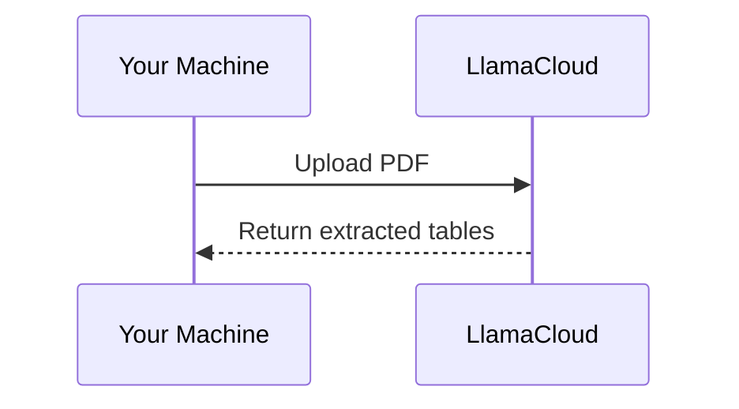

## Introduction

Have you ever copied a table from a PDF into a spreadsheet only to find the formatting completely broken? These issues include cells shifting, values landing in the wrong columns, and merged headers losing their structure.

This happens because PDFs do not store tables as structured data. They simply place text at specific coordinates on a page.

For example, a table that looks like this on screen:

```
┌───────┬───────┐
│ Name  │ Score │
├───────┼───────┤
│ Alice │  92   │
│ Bob   │  85   │
└───────┴───────┘
```

is stored in the PDF as a flat list of positioned text:

```
"Name"  at (x=72,  y=710)
"Score" at (x=200, y=710)
"Alice" at (x=72,  y=690)
"92"    at (x=200, y=690)
"Bob"   at (x=72,  y=670)
"85"    at (x=200, y=670)
```

A table extraction tool must analyze those positions, determine which text belongs in each cell, and rebuild the table structure.

The challenge becomes even greater with multi-level headers, merged cells, or tables that span multiple pages. Many tools struggle with at least one of these scenarios.

While doing research, I came across three Python tools for extracting tables from PDFs: Docling, Marker, and LlamaParse. To compare them fairly, I ran each tool on the same PDF and evaluated the results.

In this article, I'll walk through what I found and help you decide which tool may work best for your needs.

> The complete source code and Jupyter notebook for this tutorial are available on [GitHub](https://github.com/khuyentran1401/codecut-blog/blob/main/docling-vs-marker-vs-llamaparse.ipynb).

## The Test Document

All examples use the same PDF: the [Docling Technical Report](https://arxiv.org/pdf/2408.09869) from arXiv. This paper contains tables with the features that make extraction difficult:

- Multi-level headers with sub-columns
- Merged cells spanning multiple rows
- Numeric data that is easy to misalign

```python
source = "https://arxiv.org/pdf/2408.09869"
```

Some tools require a local file path instead of a URL, so let's download the PDF first:

```python
import urllib.request

# Download PDF locally (used by Marker later)
local_pdf = "docling_report.pdf"
urllib.request.urlretrieve(source, local_pdf)
```

## Docling: Vision-Language Model Pipeline

[Docling](https://github.com/docling-project/docling) is IBM's open-source document converter built specifically for structured extraction. It ships with two pipelines:

- **Default pipeline** uses two small AI models trained specifically for tables. One spots tables on the page, the other reads the grid inside
- **VLM pipeline** uses one larger AI model that can understand images, similar to how ChatGPT can describe a photo. It reads the whole page and outputs the table structure directly

The default pipeline is fast, but it can struggle with complex layouts like multi-level headers and merged cells. The VLM pipeline trades some speed for better accuracy on tricky tables, which is what we want for this comparison.

We'll use **GraniteDocling**, IBM's vision model built specifically for documents.

```
PDF page with mixed content
┌─────────────────────┐
│ Text paragraph...   │
│ Name  Score         │
│ Alice  92           │
│ Bob    85           │
│ (figure)            │
└─────────────────────┘
         │
         ▼
AI reads the whole page
and extracts the table
         │
         ▼
┌───────┬───────┐
│ Name  │ Score │
├───────┼───────┤
│ Alice │  92   │
│ Bob   │  85   │
└───────┴───────┘
```

The result is a pandas DataFrame for each table, ready for analysis.

> For Docling's full document processing capabilities beyond tables, including chunking and RAG integration, see [Transform Any PDF into Searchable AI Data with Docling](https://codecut.ai/docling-pdf-rag-document-processing/).

To install Docling, pick the variant that matches your hardware:

| Platform | Install command | Model spec |
|---|---|---|
| Apple Silicon (M1+) | `pip install "docling[vlm]" mlx-vlm` | `GRANITEDOCLING_MLX` |
| Linux / Windows (CUDA or CPU) | `pip install "docling[vlm]"` | `GRANITEDOCLING_TRANSFORMERS` |

*This article uses docling v2.93.0.*

### Table Extraction

To use the VLM pipeline, we configure `DocumentConverter` with `VlmPipeline` and select GraniteDocling as the model:

```python
from docling.datamodel import vlm_model_specs
from docling.datamodel.base_models import InputFormat
from docling.datamodel.pipeline_options import VlmPipelineOptions
from docling.document_converter import DocumentConverter, PdfFormatOption
from docling.pipeline.vlm_pipeline import VlmPipeline

pipeline_options = VlmPipelineOptions(
    vlm_options=vlm_model_specs.GRANITEDOCLING_MLX,           # Apple Silicon
    # vlm_options=vlm_model_specs.GRANITEDOCLING_TRANSFORMERS,  # Linux / Windows
)

converter = DocumentConverter(
    format_options={
        InputFormat.PDF: PdfFormatOption(
            pipeline_cls=VlmPipeline,
            pipeline_options=pipeline_options,
        )
    }
)
```

Now we can convert the PDF and measure how long it takes:

```python
%%time
result = converter.convert(source)
```

```
Wall time: 1min 50s
```

Once we have the Docling document, we can loop through all detected tables and export each one as a pandas DataFrame:

```python
for i, table in enumerate(result.document.tables):
    df = table.export_to_dataframe(doc=result.document)
    print(f"Table {i + 1}: {df.shape[0]} rows × {df.shape[1]} columns")
```

```
Table 1: 6 rows × 8 columns
Table 2: 12 rows × 6 columns
```

The PDF contains 5 tables, but Docling detected only 2 with the VLM pipeline.

Let's look at the first table. Here's the original from the PDF:


And here's what Docling extracted:

```python
# Export the first table as a DataFrame
table_1 = result.document.tables[0]
df_1 = table_1.export_to_dataframe(doc=result.document)
df_1
```

|   | 0             | 1             | 2              | 3              | 4              | 5                | 6                | 7                |
|:--|:--------------|:--------------|:---------------|:---------------|:---------------|:-----------------|:-----------------|:-----------------|
| 0 | CPU           | Thread budget | native backend | native backend | native backend | pypdfium backend | pypdfium backend | pypdfium backend |
| 1 |               |               | TTS            | Pages/s        | Mem            | TTS              | Pages/s          | Mem              |
| 2 | Apple M3 Max  | 4             | 177 s          | 1.27           | 6.20 GB        | 103 s            | 2.18             | 2.56 GB          |
| 3 | (16 cores)    | 16            | 167 s          | 1.34           | 92 s           | 92 s             | 2.45             | 2.56             |
| 4 | Intel(R) Xeon | 4             | 375 s          | 0.60           | 6.16 GB        | 239 s            | 0.94             | 2.42 GB          |
| 5 | E5-2690       | 16            | 244 s          | 0.92           | 143 s          | 1.57             | 1.57             | 2.42             |

The VLM pipeline handled values well but tripped on structure.

**Worked:**

- Each thread budget stays on its own row (4 and 16 are separate)
- Individual timing values appear in their own cells (177 s and 167 s are not concatenated)
- Most numeric values match the original

**Didn't work:**

- CPU names got split across rows: "Apple M3 Max" sits in one row and "(16 cores)" in the next
- The merged Mem cells caused values from adjacent columns to leak in (e.g., "92 s" appears in the native Mem column on row 3)
- Row 5 has "1.57" duplicated in both the pypdfium TTS and Pages/s columns

Now the second table. Here's the original from the PDF:


And here's what Docling extracted:

```python
# Export the second table as a DataFrame
table_2 = result.document.tables[1]
df_2 = table_2.export_to_dataframe(doc=result.document)
df_2
```

|    | 0              | 1     | 2     | 3                | 4    | 5    |
|:---|:---------------|:------|:------|:-----------------|:-----|:-----|
| 0  | Caption        | human | R-CNN | R-CNN10-FPRN 3x  | V1S  | V2S  |
| 1  | Footnote       | 70.1  | 70.1  | 70.1             | 70.1 | 70.1 |
| 2  | Formula        | 73.8  | 73.7  | 73.7             | 72.2 | 72.2 |
| 3  | List-item      | 81.8  | 81.8  | 81.8             | 80.1 | 80.1 |
| 4  | Page-footer    | 61.9  | 61.9  | 61.9             | 59.7 | 59.7 |
| 5  | Page-header    | 64.4  | 64.4  | 64.4             | 64.4 | 64.4 |
| 6  | Picture        | 69.8  | 69.8  | 69.8             | 64.4 | 64.4 |
| 7  | Section-header | 68.7  | 68.7  | 68.7             | 64.4 | 68.7 |
| 8  | Table          | 82.8  | 82.8  | 82.8             | 64.4 | 82.8 |
| 9  | Text           | 85.8  | 85.8  | 85.8             | 64.4 | 85.8 |
| 10 | Title          | 86.8  | 86.8  | 86.8             | 64.4 | 86.8 |
| 11 | All            | 86.8  | 86.8  | 86.8             | 64.4 | 86.8 |

The VLM pipeline struggled badly with this denser table.

**Worked:**

- The 12 row labels (Caption, Footnote, ..., Title, All) match the original

**Didn't work:**

- Column headers are hallucinated: the original has "MRCNN R50", "MRCNN R101", "FRCNN R101", "YOLO v5x6", but the VLM output shows "R-CNN", "R-CNN10-FPRN 3x", "V1S", "V2S"
- Numeric values don't match the original. The Footnote row reads "70.1 70.1 70.1 70.1 70.1" instead of "83-91 70.9 71.8 73.7 77.2"
- Column 4 shows "64.4" repeating across 7 consecutive rows

This happens because the VLM writes cells one at a time, similar to how ChatGPT writes a response word by word. When the table has many similar-looking numbers, the model can get stuck and keep repeating the same value, which is why "64.4" appears 7 times in a row.

**Conclusion:** Docling's VLM pipeline handles simple tables well, but produces unreliable results on dense numeric data, where it can hallucinate column names, repeat values across rows, and lose track of merged cells.

### Performance

Docling took about 1 minute 50 seconds for the full 6-page PDF on an Apple M5 Pro (64 GB RAM). Most of that time is spent on the GPU: GraniteDocling reads each page as an image and generates the table structure one token at a time, which pins the GPU at near-full utilization.

## Marker: Vision Transformer Pipeline

[Marker](https://github.com/datalab-to/marker) is an open-source PDF-to-Markdown converter built on the Surya layout engine. Unlike Docling's two-stage pipeline, Marker runs five stages for table extraction:

- **Layout detection**: a Vision Transformer identifies table regions on each page
- **OCR error detection**: flags misrecognized text
- **Bounding box detection**: locates individual cell boundaries
- **Table recognition**: reconstructs row/column structure from detected cells
- **Text recognition**: extracts text from all detected regions

Here is how the five stages work together:

```
PDF page
┌─────────────────────┐
│ Text paragraph...   │
│ Name  Score         │
│ Alice  92           │
│ Bob    85           │
└─────────────────────┘
         │
         ▼
1. Layout detection → finds [TABLE] region
2. OCR error detection → fixes misread text
         │
         ▼
3. Bounding box detection
┌──────────────────┐
│ [Name]  [Score]  │
│ [Alice] [92]     │
│ [Bob]   [85]     │
└──────────────────┘
         │
         ▼
4. Table recognition → maps cells to rows/columns
5. Text recognition → extracts final text
         │
         ▼
| Name  | Score |
|-------|-------|
| Alice | 92    |
| Bob   | 85    |
```

To install Marker, run:

```bash
pip install marker-pdf
```

*This article uses marker v1.10.2.*

### Table Extraction

Marker provides a dedicated `TableConverter` that extracts only tables from a document, returning them as Markdown:

```python
from marker.converters.table import TableConverter
from marker.models import create_model_dict
from marker.output import text_from_rendered

models = create_model_dict()
converter = TableConverter(artifact_dict=models)
```

Convert the PDF and measure how long it takes:

```python
%%time
rendered = converter(local_pdf)
table_md, _, images = text_from_rendered(rendered)
```

```
Wall time: 47.1 s
```

Since `TableConverter` returns all tables as a single Markdown string, we split them on blank lines:

```python
tables = table_md.strip().split("\n\n")
print(f"Tables found: {len(tables)}")
```

```
Tables found: 3
```

Let's look at the first table. Here's the original from the PDF:


And here's what Marker extracted:

```python
print(tables[0])
```

| CPU                                    | Thread&lt;br&gt;budget | native backend |              |         | pypdfium backend |              |         |
|----------------------------------------|------------------|----------------|--------------|---------|------------------|--------------|---------|
|                                        |                  | TTS            | Pages/s      | Mem     | TTS              | Pages/s      | Mem     |
| Apple M3 Max&lt;br&gt;(16 cores)             | 4&lt;br&gt;16          | 177 s&lt;br&gt;167 s | 1.27&lt;br&gt;1.34 | 6.20 GB | 103 s&lt;br&gt;92 s    | 2.18&lt;br&gt;2.45 | 2.56 GB |
| Intel(R) Xeon&lt;br&gt;E5-2690&lt;br&gt;(16 cores) | 4&lt;br&gt;16          | 375 s&lt;br&gt;244 s | 0.60&lt;br&gt;0.92 | 6.16 GB | 239 s&lt;br&gt;143 s   | 0.94&lt;br&gt;1.57 | 2.42 GB |

Marker handled this table well.

**Worked:**

- The two-tier header is preserved across two rows: "native backend" and "pypdfium backend" sit on the first row, with their sub-columns (TTS, Pages/s, Mem) on the second
- Multi-line CPU names stay in one cell using `<br>` tags (e.g., "Apple M3 Max<br>(16 cores)")
- Multi-value cells preserve individual numbers with `<br>` separators (e.g., "177 s<br>167 s"), so each value is easy to split programmatically later
- Merged Mem cells correctly show a single value (6.20 GB) without duplication
- All numeric values match the original

**Didn't work:**

- The two-tier header takes up two rows instead of being flattened, so reading this into pandas requires extra handling

Let's look at the second table. Here's the original from the PDF:


And here's what Marker extracted:

```python
print(tables[1])
```

|                                | human           | MRCNN |          | FRCNN YOLO |      |
|--------------------------------|-----------------|-------|----------|------------|------|
|                                |                 |       | R50 R101 | R101       | v5x6 |
| Caption                        | 84-89 68.4 71.5 |       |          | 70.1       | 77.7 |
| Footnote                       | 83-91 70.9 71.8 |       |          | 73.7       | 77.2 |
| Formula                        | 83-85 60.1 63.4 |       |          | 63.5       | 66.2 |
| List-item                      | 87-88 81.2 80.8 |       |          | 81.0       | 86.2 |
| Page-footer                    | 93-94 61.6 59.3 |       |          | 58.9       | 61.1 |
| Page-header                    | 85-89 71.9 70.0 |       |          | 72.0       | 67.9 |
| Picture                        | 69-71 71.7 72.7 |       |          | 72.0       | 77.1 |
| Section-header 83-84 67.6 69.3 |                 |       |          | 68.4       | 74.6 |
| Table                          | 77-81 82.2 82.9 |       |          | 82.2       | 86.3 |
| Text                           | 84-86 84.6 85.8 |       |          | 85.4       | 88.1 |
| Title                          | 60-72 76.7 80.4 |       |          | 79.9       | 82.7 |
| All                            | 82-83 72.4 73.5 |       |          | 73.4       | 76.8 |

Marker struggled with this denser table.

**Worked:**

- All 12 row labels are preserved (Caption, Footnote, ..., Title, All)
- Values for the FRCNN R101 and YOLO v5x6 columns extracted correctly

**Didn't work:**

- Header parents merged: "human" and "MRCNN" share a column header, "FRCNN" and "YOLO" merged into one cell
- The human, MRCNN R50, and MRCNN R101 values are packed into one cell per row (e.g., "84-89 68.4 71.5"), leaving the MRCNN columns empty
- The Section-header row label merged with its data ("Section-header 83-84 67.6 69.3"), breaking that row's alignment

Let's look at the third table. Here's the original from the PDF:


And here's what Marker extracted:

```python
print(tables[2])
```

|                | human | MRCNN | MRCNN | FRCNN | YOLO |
|----------------|-------|-------|-------|-------|------|
|                | human | R50   | R101  | R101  | v5x6 |
| Caption        | 84-89 | 68.4  | 71.5  | 70.1  | 77.7 |
| Footnote       | 83-91 | 70.9  | 71.8  | 73.7  | 77.2 |
| Formula        | 83-85 | 60.1  | 63.4  | 63.5  | 66.2 |
| List-item      | 87-88 | 81.2  | 80.8  | 81.0  | 86.2 |
| Page-footer    | 93-94 | 61.6  | 59.3  | 58.9  | 61.1 |
| Page-header    | 85-89 | 71.9  | 70.0  | 72.0  | 67.9 |
| Picture        | 69-71 | 71.7  | 72.7  | 72.0  | 77.1 |
| Section-header | 83-84 | 67.6  | 69.3  | 68.4  | 74.6 |
| Table          | 77-81 | 82.2  | 82.9  | 82.2  | 86.3 |
| Text           | 84-86 | 84.6  | 85.8  | 85.4  | 88.1 |
| Title          | 60-72 | 76.7  | 80.4  | 79.9  | 82.7 |
| All            | 82-83 | 72.4  | 73.5  | 73.4  | 76.8 |

This table has clear visual separation between rows and columns, while the previous one did not. The visible gaps give Marker's vision model exact boundaries to read, so all 12 rows and 5 columns extract correctly.

**Conclusion:** Marker's pipeline handles tables with clear visual separation well, but struggles when rows and columns are packed close together without visible borders.

### Performance

Marker took about 47 seconds for the full 6-page PDF on an Apple M5 Pro (64 GB RAM), more than twice as fast as Docling's VLM pipeline. The speed difference comes down to architecture:

- **Docling** runs a single large vision-language model that reads each page as an image and generates the table structure one token at a time. Large models take time per token, so the total runtime adds up.
- **Marker** runs a 5-stage pipeline of smaller specialized models that mostly do classification or detection, avoiding the slow token-by-token generation that VLMs need.

## LlamaParse: LLM-Guided Extraction

[LlamaParse](https://github.com/run-llama/llama_cloud_services) is a cloud-hosted document parser by LlamaIndex that takes a different approach:

- **Cloud-based**: the PDF is uploaded to LlamaCloud instead of being processed locally
- **LLM-guided**: an LLM interprets each page and identifies tables, returning structured row data

Here is how it works:

```
PDF file
┌─────────────────────┐
│ Name  Score         │
│ Alice  92           │
│ Bob    85           │
└─────────────────────┘
         │
         ▼ upload
┌─────────────────────┐
│     LlamaCloud      │
│                     │
│  LLM reads the page │
│  and identifies     │
│  table structure    │
└─────────────────────┘
         │
         ▼ response
┌───────┬───────┐
│ Name  │ Score │
├───────┼───────┤
│ Alice │  92   │
│ Bob   │  85   │
└───────┴───────┘
```

> For extracting structured data from images like receipts using the same LlamaIndex ecosystem, see [Turn Receipt Images into Spreadsheets with LlamaIndex](https://codecut.ai/llamaindex-receipt-data-extraction/).

To install LlamaParse, run:

```bash
pip install llama-parse
```

*This article uses llama-parse v0.6.54.*

LlamaParse requires an API key from [LlamaIndex Cloud](https://cloud.llamaindex.ai/api-key). The free tier includes 10,000 credits per month (basic parsing costs 1 credit per page; advanced modes like `parse_page_with_agent` cost more).

Create a `.env` file with your API key:

```
LLAMA_CLOUD_API_KEY=llx-...
```

```python
from dotenv import load_dotenv

load_dotenv()
```

### Table Extraction

To extract tables, we create a `LlamaParse` instance with two key settings:

- `parse_page_with_agent`: tells LlamaCloud to use an LLM agent that reads each page and returns structured items (tables, text, figures)
- `output_tables_as_HTML=True`: returns tables as HTML instead of Markdown, which better preserves multi-level headers

```python
from llama_cloud_services import LlamaParse

parser = LlamaParse(
    parse_mode="parse_page_with_agent",
    output_tables_as_HTML=True,
)
```

Now let's convert the PDF and measure how long it takes:

```python
%%time
result = parser.parse(local_pdf)
```

```
Wall time: 8.54 s
```

We can then iterate through each page's items and collect only the tables:

```python
all_tables = []
for page in result.pages:
    for item in page.items:
        if item.type == "table":
            all_tables.append(item)

print(f"Items tagged as table: {len(all_tables)}")
```

```
Items tagged as table: 5
```

Not every item LlamaParse tagged as a table is actually a table. The second item is the paper's title page, and the fourth is a figure. We'll filter both out and keep only the real tables.

```python
incorrect_table_indices = (1, 3)

tables = [t for i, t in enumerate(all_tables) if i not in incorrect_table_indices]
print(f"Actual tables: {len(tables)}")
```

```
Actual tables: 3
```

Let's look at the first table. Here's the original from the PDF:


And here's what LlamaParse extracted:

```python
print(tables[0].md)
```

| CPU                                      | Thread budget | native backend&lt;br/&gt;TTS | native backend&lt;br/&gt;Pages/s | native backend&lt;br/&gt;Mem | pypdfium backend&lt;br/&gt;TTS | pypdfium backend&lt;br/&gt;Pages/s | pypdfium backend&lt;br/&gt;Mem | pypdfium backend&lt;br/&gt;Mem |
| ---------------------------------------- | ------------- | ---------------------- | -------------------------- | ---------------------- | ------------------------ | ---------------------------- | ------------------------ | ------------------------ |
| Apple M3 Max&lt;br/&gt;(16 cores)              | 4             | 177 s                  | 1.27                       | 6.20 GB                | 103 s                    | 2.18                         | 2.56 GB                  |                          |
|                                          | 16            | 167 s                  | 1.34                       |                        | 92 s                     | 2.45                         |                          |                          |
| Intel(R) Xeon&lt;br/&gt;E5-2690&lt;br/&gt;(16 cores) | 4             | 375 s                  | 0.60                       | 6.16 GB                | 239 s                    | 0.94                         | 2.42 GB                  |                          |
|                                          | 16            | 244 s                  | 0.92                       |                        | 143 s                    | 1.57                         |                          |                          |

LlamaParse handled this table well, with one minor quirk.

**Worked:**

- All numeric values land in their correct cells (177 s, 1.27, 6.20 GB, etc.)
- Multi-line CPU names stay in one cell ("Apple M3 Max<br/>(16 cores)"), and thread budget values sit on separate rows
- The two-tier header is flattened into combined names like "native backend<br/>TTS", with merged Mem cells correctly shown once per CPU group

**Didn't work:**

- The output includes a duplicate empty "pypdfium backend<br/>Mem" column at the end

Let's look at the second table. Here's the original from the PDF:


And here's what LlamaParse extracted:

```python
print(tables[1].md)
```

|                | human | MRCNN R50 | MRCNN R101 | FRCNN R101 | YOLO v5x6 |
| -------------- | ----- | --------- | ---------- | ---------- | --------- |
| Caption        | 84-89 | 68.4      | 71.5       | 70.1       | 77.7      |
| Footnote       | 83-91 | 70.9      | 71.8       | 73.7       | 77.2      |
| Formula        | 83-85 | 60.1      | 63.4       | 63.5       | 66.2      |
| List-item      | 87-88 | 81.2      | 80.8       | 81.0       | 86.2      |
| Page-footer    | 93-94 | 61.6      | 59.3       | 58.9       | 61.1      |
| Page-header    | 85-89 | 71.9      | 70.0       | 72.0       | 67.9      |
| Picture        | 69-71 | 71.7      | 72.7       | 72.0       | 77.1      |
| Section-header | 83-84 | 67.6      | 69.3       | 68.4       | 74.6      |
| Table          | 77-81 | 82.2      | 82.9       | 82.2       | 86.3      |
| Text           | 84-86 | 84.6      | 85.8       | 85.4       | 88.1      |
| Title          | 60-72 | 76.7      | 80.4       | 79.9       | 82.7      |
| All            | 82-83 | 72.4      | 73.5       | 73.4       | 76.8      |

LlamaParse handled this table perfectly:

- All 12 row labels match the original (Caption, Footnote, ..., All)
- All 5 columns are correctly named: human, MRCNN R50, MRCNN R101, FRCNN R101, YOLO v5x6
- All numeric values match the source, including the "human" inter-annotator range column (84-89, 83-91, etc.)

Let's look at the third table. Here's the original from the PDF:


And here's what LlamaParse extracted:

```python
print(tables[2].md)
```

| class label    | Count   | % of Total&lt;br/&gt;Train | % of Total&lt;br/&gt;Test | % of Total&lt;br/&gt;Val | triple inter-annotator mAP @ 0.5-0.95 (%)&lt;br/&gt;All | triple inter-annotator mAP @ 0.5-0.95 (%)&lt;br/&gt;Fin | triple inter-annotator mAP @ 0.5-0.95 (%)&lt;br/&gt;Man | triple inter-annotator mAP @ 0.5-0.95 (%)&lt;br/&gt;Sci | triple inter-annotator mAP @ 0.5-0.95 (%)&lt;br/&gt;Law | triple inter-annotator mAP @ 0.5-0.95 (%)&lt;br/&gt;Pat | triple inter-annotator mAP @ 0.5-0.95 (%)&lt;br/&gt;Ten |
| -------------- | ------- | -------------------- | ------------------- | ------------------ | ------------------------------------------------- | ------------------------------------------------- | ------------------------------------------------- | ------------------------------------------------- | ------------------------------------------------- | ------------------------------------------------- | ------------------------------------------------- |
| Caption        | 22524   | 2.04                 | 1.77                | 2.32               | 84-89                                             | 40-61                                             | 86-92                                             | 94-99                                             | 95-99                                             | 69-78                                             | n/a                                               |
| Footnote       | 6318    | 0.60                 | 0.31                | 0.58               | 83-91                                             | n/a                                               | 100                                               | 62-88                                             | 85-94                                             | n/a                                               | 82-97                                             |
| Formula        | 25027   | 2.25                 | 1.90                | 2.96               | 83-85                                             | n/a                                               | n/a                                               | 84-87                                             | 86-96                                             | n/a                                               | n/a                                               |
| List-item      | 185660  | 17.19                | 13.34               | 15.82              | 87-88                                             | 74-83                                             | 90-92                                             | 97-97                                             | 81-85                                             | 75-88                                             | 93-95                                             |
| Page-footer    | 70878   | 6.51                 | 5.58                | 6.00               | 93-94                                             | 88-90                                             | 95-96                                             | 100                                               | 92-97                                             | 100                                               | 96-98                                             |
| Page-header    | 58022   | 5.10                 | 6.70                | 5.06               | 85-89                                             | 66-76                                             | 90-94                                             | 98-100                                            | 91-92                                             | 97-99                                             | 81-86                                             |
| Picture        | 45976   | 4.21                 | 2.78                | 5.31               | 69-71                                             | 56-59                                             | 82-86                                             | 69-82                                             | 80-95                                             | 66-71                                             | 59-76                                             |
| Section-header | 142884  | 12.60                | 15.77               | 12.85              | 83-84                                             | 76-81                                             | 90-92                                             | 94-95                                             | 87-94                                             | 69-73                                             | 78-86                                             |
| Table          | 34733   | 3.20                 | 2.27                | 3.60               | 77-81                                             | 75-80                                             | 83-86                                             | 98-99                                             | 58-80                                             | 79-84                                             | 70-85                                             |
| Text           | 510377  | 45.82                | 49.28               | 45.00              | 84-86                                             | 81-86                                             | 88-93                                             | 89-93                                             | 87-92                                             | 71-79                                             | 87-95                                             |
| Title          | 5071    | 0.47                 | 0.30                | 0.50               | 60-72                                             | 24-63                                             | 50-63                                             | 94-100                                            | 82-96                                             | 68-79                                             | 24-56                                             |
| Total          | 1107470 | 941123               | 99816               | 66531              | 82-83                                             | 71-74                                             | 79-81                                             | 89-94                                             | 86-91                                             | 71-76                                             | 68-85                                             |

LlamaParse correctly extracted this complex table:

- All 12 data rows plus the Total row appear with correct values, including n/a entries
- The two-tier headers use `<br/>` to preserve the parent-child relationship (e.g., "% of Total<br/>Train")
- The "triple inter-annotator mAP @ 0.5-0.95 (%)" prefix is repeated for every sub-column (All, Fin, Man, etc.), making headers verbose but unambiguous

**Conclusion:** LlamaParse produces the most accurate extraction of the three tools across simple and complex tables alike, with only occasional column hallucinations.

### Performance

LlamaParse finished in 8.54 seconds, the fastest of the three tools (Docling took 1 min 50s, Marker took 47s).

Unlike Docling and Marker, LlamaParse runs no models on your machine. It uploads the PDF to LlamaCloud, an LLM agent reads each page, and the result comes back:



The runtime is mostly network upload time and server processing, so it depends on your internet speed and current LlamaCloud load rather than your local hardware.

## Summary

The table below summarizes the key differences we found after testing all three tools on the same PDF:

| Feature | Docling | Marker | LlamaParse |
|---------|---------|--------|------------|
| **Table detection** | Vision-language model (local) | 5-stage specialized pipeline (local) | LLM agent (cloud) |
| **Multi-level headers** | Returns integer column names; mishandles parent groups | Keeps as separate rows with `<br>` tags | Flattens with `<br/>` tags, preserves grouping |
| **Dense numeric tables** | Hallucinates values, repetition loops | Merges columns, packs values into single cells | Extracts all values correctly |
| **Speed (6-page PDF)** | ~1 min 50s | ~47s | ~8.54s |
| **Dependencies** | docling[vlm] + mlx-vlm (Apple) or transformers | marker-pdf | API key |
| **Pricing** | Free (MIT) | Free (GPL-3.0) | Free tier (10k credits/month) |

In short:

- **LlamaParse** wins on speed and accuracy. It's the fastest overall and produces the cleanest output, but it requires sending PDFs to LlamaCloud.
- **Marker** is the best local option. It's faster than Docling and handles simple tables well, but it merges columns on dense layouts.
- **Docling** is the slowest of the three and prone to hallucinating values on dense tables.

When to use each:

- Use **LlamaParse** if your documents aren't sensitive and you want the best accuracy.
- Use **Marker** if you must stay local.
- Use **Docling** for its [broader document conversion features](https://codecut.ai/docling-pdf-rag-document-processing/) beyong just table extraction like chunking and RAG.

## Try It Yourself

These benchmarks are based on a single academic PDF tested on an Apple M5 Pro (64 GB RAM). Table complexity, document length, and hardware all affect the results. The best way to pick the right tool is to run each one on a sample of your own PDFs.

Docling and Marker are completely free, and LlamaParse's free tier gives you 10,000 credits per month to experiment with.

